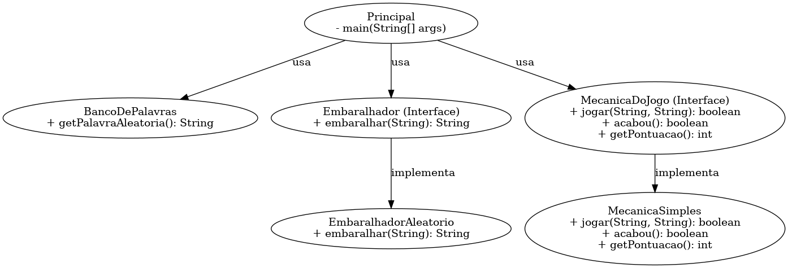

# 🔀 Jogo de Palavras Embaralhadas (Java)
👨‍💻 Autor
Luis Felipe Ramalho Carvalho
Projeto acadêmico de Java com foco em arquitetura orientada a objetos.

Projeto Java desenvolvido com foco em Programação Orientada a Objetos (POO), que implementa um jogo onde o usuário deve adivinhar palavras embaralhadas.  
A arquitetura foi pensada para ser modular e extensível, com uso de **interfaces**, **herança** e **separação de responsabilidades**.

---

## 🧩 Diagrama de Classes UML



---

## 🎯 Objetivo

- Sortear uma palavra aleatória de um banco
- Embaralhar a palavra (por meio de uma interface)
- Desafiar o jogador a descobrir a palavra original
- Controlar o fluxo do jogo com uma mecânica simples

---

## 📁 Estrutura do Projeto

📦 jogo-palavras
┣ 📜 Principal.java # Classe principal (main)

┣ 📜 BancoDePalavras.java # Responsável por sortear palavras do arquivo

┣ 📜 palavras.txt # Lista de palavras disponíveis para o jogo

┣ 📜 Embaralhador.java # Interface que define o contrato de embaralhamento

┣ 📜 EmbaralhadorAleatorio.java # Embaralha letras aleatoriamente

┣ 📜 MecanicaDoJogo.java # Interface para mecânicas de jogo

┣ 📜 MecanicaSimples.java # Implementação básica da mecânica

┣ 📜 JogoTest.java # Classe de testes


💬 Exemplo de execução
Palavra embaralhada: UTOPOMRACOD
Tente adivinhar: computador

✅ Acertou! Pontuação: 1

### Pré-requisitos:
- Java instalado (versão 8 ou superior)

### Passos:

```bash
javac *.java
java Principal
